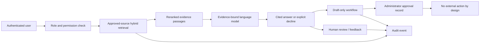

# Atlas Evidence Agent

Atlas Evidence Agent is a **secure hybrid RAG workspace** for internal firm knowledge. It retrieves only curator-approved documents, combines lexical and semantic-term relevance, reranks the evidence, and asks the language model to answer only from that bounded evidence set. The workspace is designed to make uncertainty visible: when appropriate evidence is unavailable, it declines rather than inventing an answer.

> **Important:** This public repository intentionally contains application code and public-safe documentation only. It must never contain uploaded firm documents, database exports, audit contents, credentials, personal data, or API keys.

## What the initial release includes

| Area | Capability |
|---|---|
| Authentication | Built-in user authentication with `admin` and `user` roles. The project owner is made an administrator at sign-in. |
| Knowledge curation | Administrator-created source boundaries with classification, audience, owner, and approval status. |
| Secure ingestion | PDF, DOCX, XLS/XLSX, CSV, TXT, Markdown, and JSON ingestion. Original bytes are held in object storage; metadata and searchable chunks are kept in the database. |
| Hybrid retrieval | Keyword relevance plus normalised semantic terms, followed by transparent reranking and visible evidence passages. |
| Evidence answers | Citations point to the document and source used by the answer. The assistant uses no unprovided outside knowledge. |
| Agent modes | Evidence answer, source comparison, policy-aware internal drafting, and controlled planning. |
| Human control | Every workflow item is a draft. Approval is recorded but does not send, write, or update any external system. |
| Governance | Chat, retrieval, feedback, documents, source approval, evaluation, and draft reviews create audit records. |
| Evaluation | Administrator-owned test cases evaluate retrieval, expected answer/decline behavior, and simple reference coverage. |
| Notifications | The project owner is notified when ingestion fails, a serious issue is reported, or a draft requires review. |

## Operational architecture



## Guardrails

The initial workspace deliberately limits how much the system can do. It excludes unapproved and archived sources from ordinary retrieval, applies the user’s role before content is selected, treats retrieved text as untrusted reference material rather than instructions, requires citations for substantive responses, and preserves a clear insufficient-evidence outcome.

No current workflow can write to a CRM, post to Slack or Teams, send an email, alter a record, approve a payment, or complete any external action. Adding an external connection later must begin read-only or draft-only, with a named data owner and a specific approval gate.

## Run locally

The managed workspace supplies authenticated user access, database configuration, secure storage, notifications, and server-side model credentials. In an equivalent development environment, install dependencies and use the provided scripts:

```bash
pnpm install
pnpm test
pnpm check
pnpm dev
```

## Recommended first pilot

1. Create a single **draft** source for one low-risk document collection.
2. Upload a small, approved group of documents and confirm that ingestion reaches `ready`.
3. Approve the source only after a business owner confirms its scope, classification, and user audience.
4. Add 30–50 realistic evaluation questions, including questions that should result in a decline.
5. Run the pilot in evidence-answer mode before permitting draft or planning modes.
6. Review feedback, audit activity, acceptance rates, and source quality with the business owner before connecting another system.

## Connection readiness

The next safe connections are approved SharePoint libraries, selected Google Drive shared folders, or a read-only CRM lookup. For any connection, use the least privileged account available; document the allowed sources, intended user groups, update cadence, data retention, and audit requirements. Do not connect personal drives, a complete company file estate, or a writable business system as a first integration.

## Repository hygiene

The `.gitignore` file excludes common environment, upload, document, and runtime paths. Before each public push, check the staged file list with `git status` and confirm it contains only source code, migrations, test fixtures that are non-sensitive, and public documentation.
